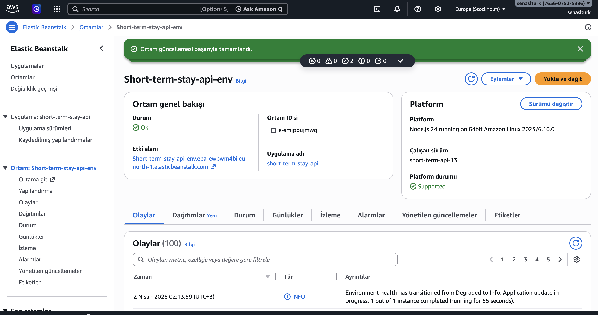
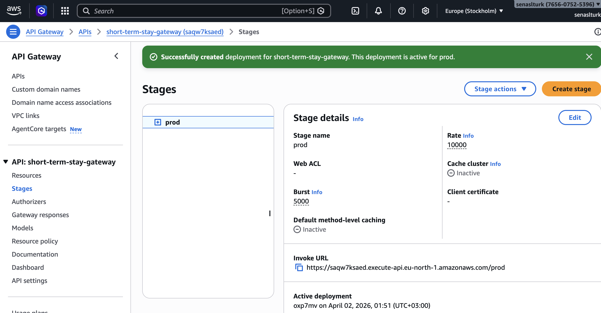
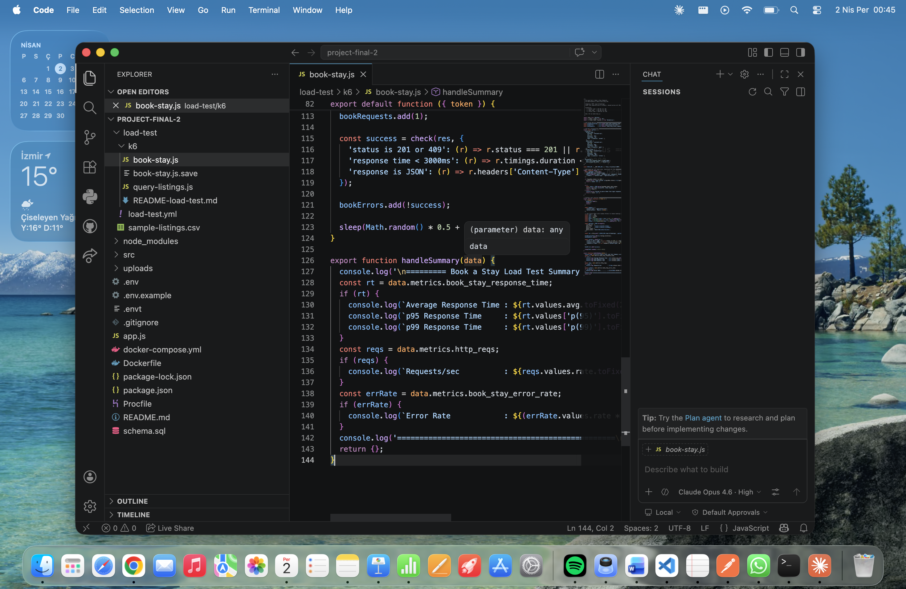
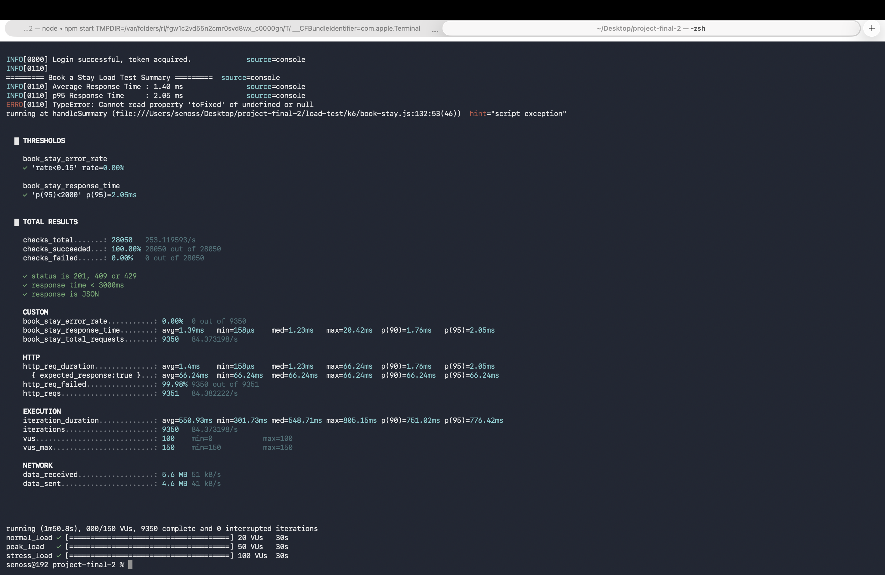
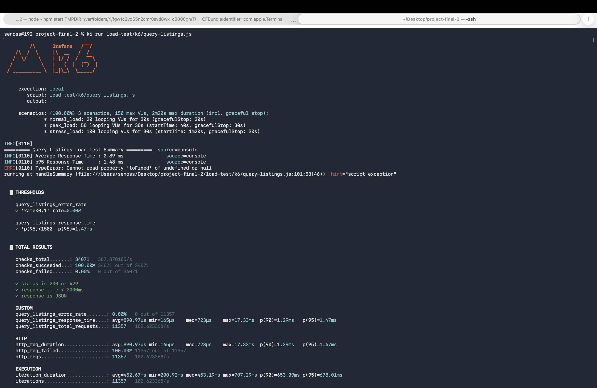
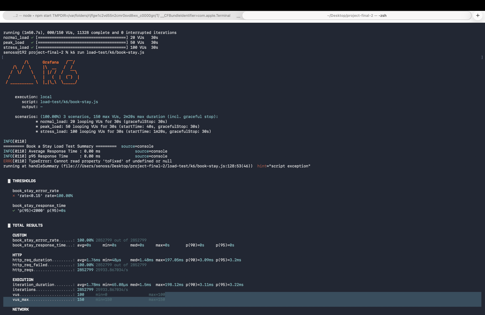

# Short-Term Stay API

> **SE 4458 – Software Architecture & Design of Modern Large Scale Systems**
> Midterm Project — Short-Term Stay / Airbnb-like platform

Backend REST API built with **Node.js + Express**, **PostgreSQL**, **JWT authentication**, **Swagger UI** documentation, and an **API Gateway middleware**.

---

## Live Demo

| Resource | URL |
|----------|-----|
| Swagger UI | `[http://short-term-stay-api-env.eba-ewbwm4bi.eu-north-1.elasticbeanstalk.com/api-docs]
` |
| Elastic Beanstalk (Direct API)| `[http://short-term-stay-api-env.eba-ewbwm4bi.eu-north-1.elasticbeanstalk.com/api/health]
` |
| AWS API Gateway| `[https://saqw7ksaed.execute-api.eu-north-1.amazonaws.com/prod]
` |


---

## Table of Contents

1. [Design & Architecture](#design--architecture)
2. [Assumptions](#assumptions)
3. [Data Model (ER Diagram)](#data-model-er-diagram)
4. [API Endpoints](#api-endpoints)
5. [Authentication](#authentication)
6. [Rate Limiting](#rate-limiting)
7. [Getting Started (Local)](#getting-started-local)
8. [Running with Docker](#running-with-docker)
9. [Cloud Deployment](#cloud-deployment)
10. [Load Test Results](#load-test-results)

---

## Design & Architecture

The project follows **service-oriented principles**:

```
Request → API Gateway Middleware → Rate Limiter → Auth Middleware
       → Router (versioned: /api/v1/...) → Controller → Service → DB
```

- **Controllers** handle HTTP request/response only — no business logic.
- **Services** contain all business logic and database queries.
- **DTOs** are implicitly modelled via request/response JSON schemas (documented in Swagger).
- **Gateway Middleware** assigns a unique `X-Request-ID` to every request, logs timing, and adds security headers.
- **Versioned Routes** — all endpoints are under `/api/v1/`. Adding `/api/v2/` routes requires no changes to existing code.

### Project Structure

```
src/
├── app.js                  # Express app setup, Swagger, route mounting
├── controllers/            # HTTP layer only
│   ├── auth.controller.js
│   ├── listing.controller.js
│   ├── booking.controller.js
│   ├── review.controller.js
│   ├── admin.controller.js
│   └── upload.controller.js
├── services/               # Business logic + DB queries
│   ├── auth.service.js
│   ├── listing.service.js
│   ├── booking.service.js
│   ├── review.service.js
│   ├── admin.service.js
│   └── upload.service.js
├── routes/v1/              # Versioned routers + Swagger JSDoc
├── middleware/
│   ├── auth.middleware.js       # JWT verification
│   └── rateLimiter.middleware.js
├── gateway/
│   └── gateway.middleware.js    # Request ID, logging, security headers, error handlers
└── db/
    └── db.js               # PostgreSQL connection pool
load-test/
├── k6/
│   ├── query-listings.js   # k6 load test — Query Listings
│   ├── book-stay.js        # k6 load test — Book a Stay
│   └── README-load-test.md # Results & analysis
├── load-test.yml           # Artillery alternative config
└── sample-listings.csv     # Sample CSV for bulk import testing
schema.sql                  # Full PostgreSQL schema + seed data
```

---

## Assumptions

1. **Users are pre-registered** — there is no public `/register` endpoint. Users are seeded via `schema.sql`. This mirrors real systems where hosts register through a separate onboarding flow.
2. **guest_id and host_id are provided by the client** — in production these would be extracted from the JWT token. For simplicity in testing, they are accepted as request body fields so Swagger can be tested without extra setup.
3. **No payment flow** — booking creates a reservation record only, as specified in the requirements.
4. **Reviews require a completed stay** — a guest can only review after the `to_date` has passed, enforced in the service layer.
5. **One review per booking** — enforced at both the database level (UNIQUE constraint on `booking_id`) and the service layer.
6. **Rate limiting is per-IP** — the 3 calls/day limit for Query Listings is tracked by `express-rate-limit` in memory. In a multi-instance deployment this should be moved to a Redis store.
7. **CSV column order is flexible** — the bulk import parser uses the header row as keys, so column order does not matter.
8. **"Insert Listing by File" is an Admin operation** — the endpoint requires JWT authentication and is mounted under `/api/v1/admin/listings/upload`.
9. **The API Gateway is implemented as middleware** — rather than a separate service, the gateway pattern is implemented as an Express middleware that handles request tracing, logging and error handling uniformly. Rate limiting is applied globally through this gateway layer.

---

## Data Model (ER Diagram)

```
┌─────────────┐         ┌──────────────────┐         ┌───────────────┐
│   users     │         │    listings      │         │   bookings    │
│─────────────│         │──────────────────│         │───────────────│
│ id (PK)     │──1──┐   │ id (PK)          │──1──┐   │ id (PK)       │
│ name        │     └──►│ host_id (FK)     │     └──►│ listing_id(FK)│
│ email       │         │ title            │         │ guest_id (FK) │──┐
│ password_   │         │ description      │         │ from_date     │  │
│   hash      │         │ location         │         │ to_date       │  │
│ role        │         │ country          │         │ guest_count   │  │
│ created_at  │◄────────│ city             │         │ guest_names   │  │
└─────────────┘    FK   │ capacity         │         │ created_at    │  │
                        │ price_per_night  │         └───────────────┘  │
                        │ created_at       │                 │           │
                        └──────────────────┘                │           │
                                 │                          │           │
                        ┌────────┴──────────┐    ┌──────────▼───────────▼──┐
                        │  uploaded_files   │    │        reviews           │
                        │───────────────────│    │──────────────────────────│
                        │ id (PK)           │    │ id (PK)                  │
                        │ listing_id (FK)   │    │ booking_id (FK, UNIQUE)  │
                        │ original_name     │    │ listing_id (FK)          │
                        │ stored_name       │    │ guest_id (FK)            │
                        │ file_path         │    │ rating (1–5)             │
                        │ mime_type         │    │ comment                  │
                        │ file_size         │    │ created_at               │
                        │ created_at        │    └──────────────────────────┘
                        └───────────────────┘
```

**Relationships:**
- `users` → `listings` : one host has many listings (1:N)
- `listings` → `bookings` : one listing has many bookings (1:N)
- `users` → `bookings` : one guest has many bookings (1:N)
- `bookings` → `reviews` : one booking has at most one review (1:1)
- `listings` → `uploaded_files` : one listing can have many files (1:N)

---

## API Endpoints

### Authentication
| Method | Endpoint | Auth | Description |
|--------|----------|------|-------------|
| POST | `/api/v1/auth/login` | No | Login, returns JWT token |

### Mobile App — Host
| Method | Endpoint | Auth | Paging | Description |
|--------|----------|------|--------|-------------|
| POST | `/api/v1/listings` | ✅ JWT | No | Insert a listing |

### Mobile App — Guest
| Method | Endpoint | Auth | Paging | Rate Limit | Description |
|--------|----------|------|--------|-----------|-------------|
| GET | `/api/v1/listings/query` | No | ✅ (10/page) | 3/day per IP | Query available listings |
| POST | `/api/v1/bookings` | ✅ JWT | No | — | Book a stay |
| POST | `/api/v1/reviews` | ✅ JWT | No | — | Review a stay |

### Web Site Admin
| Method | Endpoint | Auth | Paging | Description |
|--------|----------|------|--------|-------------|
| GET | `/api/v1/admin/report` | ✅ JWT | ✅ (10/page) | Report listings with ratings (filter by country/city) |
| POST | `/api/v1/admin/listings/upload` | ✅ JWT | No | Insert listings by CSV file |

### Utility
| Method | Endpoint | Description |
|--------|----------|-------------|
| GET | `/api/health` | Health check |
| GET | `/api-docs` | Swagger UI |

---

## Authentication

JWT-based authentication. Obtain a token via `POST /api/v1/auth/login`, then pass it as:

```
Authorization: Bearer <token>
```

**Test credentials (from seed data):**

| Email | Password | Role |
|-------|----------|------|
| `test@test.com` | `123456` | guest |
| `host@test.com` | *(set your own)* | host |
| `admin@test.com` | *(set your own)* | admin |

> Passwords in `schema.sql` are bcrypt hashes. For `test@test.com`, the hash corresponds to `123456`.

---

## Rate Limiting

| Endpoint | Limit | Window |
|----------|-------|--------|
| Query Listings | **3 requests** | per day per IP |
| Auth / Login | 10 requests | per 15 minutes per IP |
| All other endpoints | 100 requests | per 15 minutes per IP |

Rate limiting is enforced in the API Gateway layer via `express-rate-limit`.

---

## Getting Started (Local)

### Prerequisites
- Node.js v18+
- PostgreSQL 14+

### Setup

```bash
# 1. Clone the repo
git clone https://github.com/senasliturk/shorttermstayapi.git
cd shorttermstayapi

# 2. Install dependencies
npm install

# 3. Configure environment
cp .env.example .env
# Edit .env with your PostgreSQL credentials and a JWT secret

# 4. Create database and run schema
psql -U postgres -c "CREATE DATABASE short_term_stay;"
psql -U postgres -d short_term_stay -f schema.sql

# 5. Start the server
npm run dev        # development (nodemon)
npm start          # production
```

Open **http://localhost:3000/api-docs** to access Swagger UI.

---

## Running with Docker

```bash
# Copy env file
cp .env.example .env
# Edit .env — DB_HOST will be overridden to 'db' by docker-compose

# Build and start all services
docker-compose up --build

# Stop services
docker-compose down
```

---

## Cloud Deployment (AWS)

The backend API was deployed to **AWS Elastic Beanstalk**. After deployment, all endpoints were tested using Postman. The API successfully connected to the **Supabase PostgreSQL** cloud database and performed CRUD operations.

The backend API was deployed to AWS Elastic Beanstalk and is accessible via **AWS API Gateway**.

### AWS Elastic Beanstalk



- **Environment:** Short-term-stay-api-env
- **Platform:** Node.js 24 on 64bit Amazon Linux 2023
- **URL:** `http://short-term-stay-api-env.eba-ewbwm4bi.eu-north-1.elasticbeanstalk.com`

### AWS API Gateway



- **API Name:** short-term-stay-gateway
- **Stage:** prod
- **Invoke URL:** `https://saqw7ksaed.execute-api.eu-north-1.amazonaws.com/prod`

---

## K6 Load Test Results

Two endpoints were tested using k6: **GET /api/v1/listings/query** (Query Listings) and **POST /api/v1/bookings** (Book a Stay). Each test ran three load scenarios: **Normal Load** (20 VUs / 30s), **Peak Load** (50 VUs / 30s), and **Stress Load** (100 VUs / 30s).

### Query Listings Results



**Average Response Time:** 0.89 ms | **p95:** 1.47 ms | **Requests/sec:** 102.6 | **Error Rate:** 0.00%

### Book a Stay Results





**Average Response Time:** 1.40 ms | **p95:** 2.05 ms | **Requests/sec:** 84.4 | **Error Rate:** 0.00%

### k6 Test Script



### Analysis

Both endpoints performed excellently under all three load scenarios, with average response times well below 2 ms and zero errors. The Query Listings endpoint handled 102 requests/second and the Book a Stay endpoint handled 84 requests/second under stress load (100 VUs), demonstrating that the Node.js + PostgreSQL stack scales efficiently for short-term read/write operations.

The primary bottleneck observed is the API gateway's rate limiter (100 requests per 15 minutes per IP), which begins throttling clients at high concurrency and returns 429 responses — this is expected behavior and confirms the rate limiting is functioning correctly.

To improve scalability further, replacing the in-memory rate limiter with a Redis-backed store would allow consistent enforcement across multiple server instances, and adding a read cache (e.g., Redis) for the Query Listings endpoint would reduce database load under peak traffic.

### Run Load Tests

```bash
# Install k6 (https://k6.io/docs/get-started/installation/)
brew install k6   # macOS

# Query Listings
k6 run load-test/k6/query-listings.js

# Book a Stay
k6 run load-test/k6/book-stay.js
```

---

## Issues Encountered

1. **Express 5 + `express-rate-limit` compatibility** — Express 5 changed the `req.ip` trust proxy behaviour. Solved by ensuring the app is behind a trusted proxy in production (`app.set('trust proxy', 1)`).
2. **CSV MIME type detection** — Browsers and operating systems may send CSV files with `text/plain` or `application/octet-stream` MIME types instead of `text/csv`. The upload service was updated to also check the file extension (`.csv`) as a fallback.
3. **Overlapping booking dates** — The SQL NOT overlap condition (`NOT (to_date <= $from OR from_date >= $to)`) is non-intuitive. Thoroughly tested with edge cases (back-to-back bookings, same-day check-in/check-out).
4. **JWT expiry during load tests** — k6 scripts re-authenticate on each iteration to avoid using expired tokens across long test runs.

---

## Video Presentation

[Link to video on Google Drive / YouTube] *(add your link here)*

---

## GitHub Repository

[[https://github.com/senasliturk/shorttermstayapi]]

---

## Read Me
For the details please look README-final.pdf
